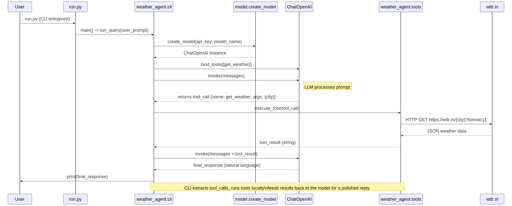

# Weather Agent

Small demo showing how to combine an LLM with a local tool that fetches
real weather data.

Files:
- `weather_agent/tools.py` - pure Python weather fetching logic
- `weather_agent/model.py` - model creation helpers
- `weather_agent/cli.py` - CLI runner that wires model + tools
- `run.py` - simple project entrypoint

Run:

```powershell
$env:OPENAI_API_KEY = "sk-your-key-here"
.venv\Scripts\python.exe run.py "Parker"
```

You can also call `run.py` without arguments; it defaults to `Denver`.

## Author

- Lakshitha Karunaratna

## Sequence Diagram



